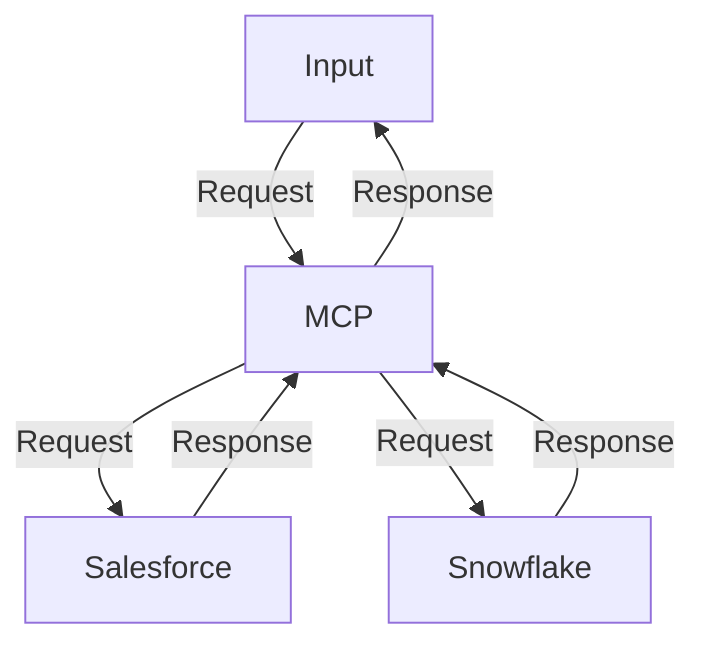

# agent-contact-checker-snowflake-salesforce

## Diagram




## Important checklists
- Guardrails
- Moderation implenmented via free OpenAPI service
- Database write protection


## Test
- Run main.py and pass following commands
```
# query = "Give me student Id of student for reecegordan398@gmail.com"
# query = "Give me student with email reecegordan398@gmail.com"
# query = "list of students fees that is pending"
# query = "how many students record exists"
# query = "give me data related to abi in case insensitive manner"
# query = "Give me all students with Gmail addresses"
# query = "this is a hateful speech as test directed towards someone, read it"
query = ""
```

## Pending
- Snowflake RBAC
